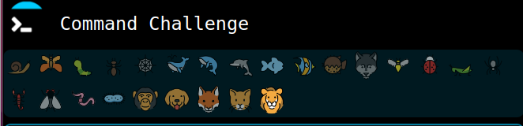
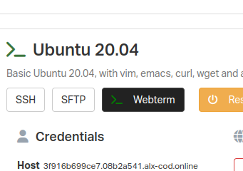
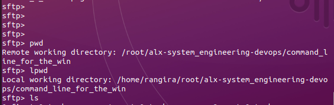
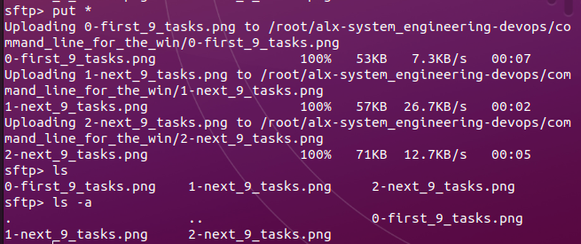

# Command Line for the Win

### "[The CMD CHALLENGE](https://intranet.alxswe.com/rltoken/a83_NOBEtXgFr1Yqej0HYA)"

This directory contains screenshots demonstrating completed levels in [The CMD CHALLENGE](https://intranet.alxswe.com/rltoken/a83_NOBEtXgFr1Yqej0HYA).

> **Note:** The levels completed are identified by counting the emojis above the question panel.
> Screenshots: 

## Setting up the SFTP Tool

To set up the SFTP tool, I followed these steps:

- Used the SFTP command provided in my Sandboxes, copied, and pasted it into my local terminal.
- Entered the password (also provided in my Sandboxes) to access the FTP's prompt.

   

- Navigated to the 'root' directory of FTP (remote) using `cd`, where I created a new directory (`command_line_for_the_win`) with `mkdir`.
- Browsed to that directory on my local machine using `lcd`. Paths for remote and local are shown below:

   

- Uploaded all screenshots to the remote using `put *`:
   

Now the README provides a clearer and more structured guide to your CMD CHALLENGE and the steps you took to set up the SFTP tool. Feel free to adjust it further based on your preferences!

